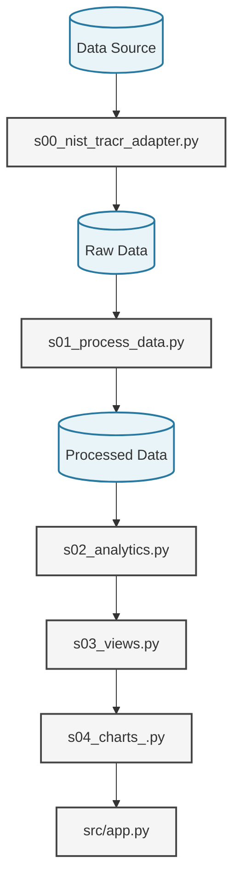

# trend-tracr

[](./pyproject.toml)
[](https://docs.astral.sh/uv/)
[](https://docs.astral.sh/ty/)
[](./LICENSE)

> Explore trends in NIST Tracking Community Resilience (TraCR) data
> with Python and reactive analytics.

## Live App

- [Live App](https://civic-interconnect.github.io/trend-tracr/)

## Explore Community Resilience Trends

This project provides an example of a real-world data analytics application
using public community resilience data from the
National Institute of Standards and Technology (NIST).

Select a community and resilience indicator to explore
how the measure changes over time.

The project models a reusable analytics pipeline:



This project provides a working starting point while leaving opportunities
to improve data preparation, analysis, visualization, and interaction.

## Project Structure

Source files show the primary flow.

- `app.py` - provides the reactive Marimo application
- `s00_nist_tracr_adapter.py` - adapts NIST TraCR data to the schema
- `s01_process_data.py` - performs minimal processing
- `s02_analytics.py` - produces analytical results
- `s03_views.py` - prepares renderer-facing views
- `s04_charts_*.py` - renders results using different visualization libraries

## Visualization Options

The project separates the analytical result
from the visualization technology.
Renderer implementations may include:

- Altair
- Matplotlib
- Plotly

This enables us explore how
different visualization libraries
express the same analytical result
and choose an appropriate renderer
for a particular application.

## Architecture

The pipeline is implemented in numbered layers:

```text
s00 acquire  ->  s01 process  ->  s02 analyze  ->  s03 view  ->  s04 render
```

| Layer | File                        | Owns                                 |
| ----- | --------------------------- | ------------------------------------ |
| `s00` | `s00_nist_tracr_adapter.py` | Source ingestion -> canonical schema |
| `s01` | `s01_process_data.py`       | Basic cleaning (types, nulls, order) |
| `s02` | `s02_analytics.py`          | `TrendResult` + `get_trend`          |
| `s03` | `s03_views.py`              | `TrendView` + `make_trend_view`      |
| `s04` | `s04_charts_*.py`           | Renderer-specific chart creation     |

### Two contracts

`TrendResult` in `s02` is the boundary between analytics and visualization.
It carries the observations plus semantics:

- `data` (year/value),
- `geography_name`,
- `indicator_name`,
- `indicator_id`,
- `unit`.

Percent change, slope, ranking, etc.
are separate analytics with their own small result types.

`TrendView` in `s03` is the boundary between view preparation and rendering.
It carries chart information:

- `data`,
- `x_field`,
- `y_field`,
- `title`,
- `x_label`,
- `y_label`.

A renderer never sees an `indicator_id` or a
`geography_id`, only x, y, and labels.
A renderer does not know where the data came from or how the
trend was computed.

### The renderers

Each `s04_charts_*.py` exposes one function with the same signature:

```python
if renderer.value == "Altair":
    chart = make_altair_trend(view)
elif renderer.value == "Plotly":
    chart = make_plotly_trend(view)
elif renderer.value == "Matplotlib":
    chart = make_matplotlib_trend(view)
```

Each renderer consumes the same view contract and returns its own native
visualization representation.

### Processing is deliberately minimal

`s01` does only what downstream layers must assume:
correct types, no null observations, sorted order.
It does not impute, smooth, deduplicate, reconcile
geographies, or handle suppressed values.

### Reusing this repo

To point this at a different dataset,
rewrite `s00_nist_tracr_adapter.py` so its output
matches the canonical schema.
Everything from `s01` onward keeps working.
The Marimo application can be exported as a browser-based WASM application.

## Extend the Project

This repository is designed to be copied, forked, modified, and extended.
Possible extensions include:

- explore a different TraCR indicator
- investigate a different community or group of communities
- improve the data-processing (cleaning and preparation)
- add or improve a visualization renderer
- improve labels, annotations, tooltips, or interaction
- compare multiple communities
- investigate the distribution of an indicator across communities
- explore relationships between two numeric indicators
- adapt the architecture to another public or organizational data source

## Run Locally

1. Set up the project environment.
2. Run the reactive Marimo application.

```shell
uv sync
uv run marimo run src/app.py
```

Hit CTRL+c to quit.

## Command Reference

<details markdown>
<summary>Show command reference</summary>

### In a machine terminal (open in your `Repos` folder)

Open a machine terminal in your `Repos` folder,
change directory (cd) into the new folder,
and run `code .` to open only this project in VS Code:

```shell
git clone https://github.com/civic-interconnect/trend-tracr
cd trend-tracr
code .
```

When VS Code opens, accept the Extension Recommendations
(click **`Install All`** or similar when asked).

### In a VS Code terminal

Use VS Code menu option `Terminal` / `New Terminal`
to open a **VS Code terminal** in the root project folder.

Set up a local project Python environment managed by `uv`:

```shell
uv self update
uv python pin 3.14

uv python install
uv lock --upgrade
uv sync
```

If asked: "We noticed a new environment has been created.
Do you want to select it for the workspace folder?" Click **"Yes"**.
If successful, you'll see a new `.venv` folder appear in the root project folder.

Install and run pre-commit checks (twice if necessary as shown below):

```shell
uv run pre-commit install
uv run pre-commit autoupdate

git add -A
uv run pre-commit run --all-files
# repeat if changes were made by pre-commit tasks
uv run pre-commit run --all-files
```

### Daily Workflow (Working With Python Project Code)

VS Code should have only this project open.
Open a VS Code terminal (menu: `Terminal` / `New Terminal`) and run:

```shell
git pull

# Served as an app (hit CTRL+c to quit)
uv run marimo run src/app.py

# Interactive editing
uv run marimo edit src/app.py

# check wasm locally
# uv run python tools/build_fips_to_county_lookup.py
Remove-Item -Recurse -Force _site
uv sync
uv run marimo export html-wasm src/app.py -o _site --mode run
uv run python -m http.server 8000 -d _site
# open browser to: http://localhost:8000

# do chores
uv run ruff format .
uv run ruff check . --fix
uv run ty check
uv run python -m pytest
```

While editing the project, repeat the commands above to
run files and check them as needed.

Save progress frequently.
Some tools may make changes;
you may need to **re-run git `add` and `commit`**
to ensure everything gets committed before pushing.

```shell
git add -A
git commit -m "your message here"
# repeat if changes were made (try the UP ARROW)
git add -A
git commit -m "your message here"

git push -u origin main
```

</details>

## Data Source

NIST Tracking Community Resilience (TraCR) is a longitudinal community
resilience dataset released through the NIST Public Data Repository.
The source TraCR database is wide.

The production adapter is: `s00_nist_tracr_adapter.py`.
The adapter converts it to the canonical long-form schema:

```text
geography_id
geography_name
indicator_id
indicator_name
unit
year
value
```

Indicator metadata comes from the TraCR metadata supplied by NIST.
Human-readable geography names are joined from an authoritative Census
geography reference file using FIPS identifiers.

See:

- [data/data-card.md](data/data-card.md)

## Citation

- [CITATION.cff](./CITATION.cff)

## License

This project is licensed under the [MIT License](./LICENSE).
